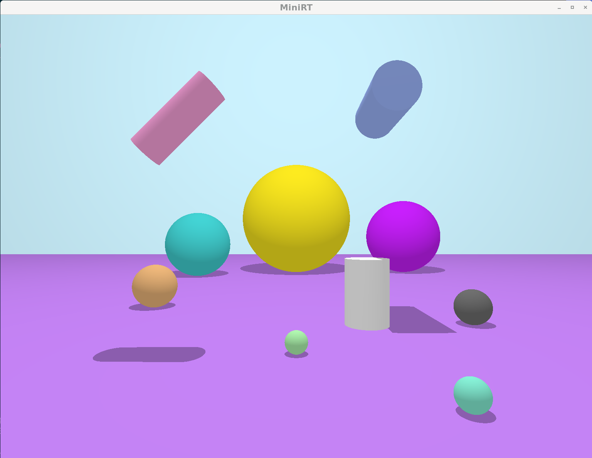

# MiniRT

*This project has been created as part of the 42 curriculum by hogu and dloustal*

## Description

This project is a Ray Tracer written in C. 

From Wikipedia: "In 3D computer graphics, ray tracing is a technique for modeling light transport for use in a wide variety of rendering algorithms for generating digital images."

The program works by reading a *scene description file* with extension .rt containing information about the position, size, color and texture of different shapes and then rendering the image. We use the [MLX42 library](https://github.com/codam-coding-college/MLX42) for graphics. 

##### Mandatory features

In the *mandatory* part of the project, we render planes, spheres and cylinders with color and no texture. 

##### Bonus features 

*Bonus* features include:

- Color disruption in the form of a checkerboard pattern for any of the surfaces
- Specular reflection
- Colored light
- Multi-spot lights


## Instructions

Run 

	make

to make the program with basic features

Run 

	make bonus

to make the program with bonus (and basic) features

To run the program with basic features, run

	./miniRT <Scene_description_file.rt>


Or

	./miniRT_bonus <Scene_description_file.rt>
for the program with bonus features


#### Scene description file .rt formatting

Elements in a scene are described by an identifier, followed by any specific information to that element. 

Elements included in the mandatory features are described as follows:

- Ambient lighting:
	- Identiifer: A
	- Ambient lighting ration in the range [0.0, 1.0]
	- R, G, B color with each element in the range [0, 255]

- Camera
	- Identifier: C
	- x, y, z coordinates of the viewpoint
	- 3D orientation vector, where each dimension is in the range [-1.0, 1.0]
	- FOV: Horizontal field of view in degrees in the range [0, 180]

- Light point
	- Identifier: L
	- x, y, z coordinates of the light point
	- the light brightness ratio in the range [0.0, 1.0]
	- (only in the bonus part) R, G, B color with each element in the range [0, 255]

- Sphere
	- Identifier: sp
	- x, y, z coordinates of the sphere center
	- the sphere diameter
	- R, G, B color of the surface with each element in the range [0, 255]

- Plane
	- Identifier: pl
	- x, y, z coordinates of a point in the plane
	- 3D normal vector with each coordinate in the range [-1.0, 1.0]
	- R, G, B color of the surface with each element in the range [0, 255]

- Cylinder
	- Identifier: cy
	- x, y, z coordinates of the center of the cylinder
	- 3D vector of axis of the cylinder, with each coordinate in the range [-1.0, 1.0]
	- the cylinder diameter
	- the cylinder height
	- R, G, B color of the surface with each element in the range [0, 255]

Each element can be separated by one or more line breaks, the order in which elements appear is irrelevant. Each type of information from an element can be separated by one or more spaces. Vectors (of position or of color) should be written in format ```x,y,z``` without spaces after the commas. Elements defined by a capital letter can only be declared once in the scene for the mandatory part; in the bonus part there should still be unique camera and ambient light, but there can be several light points. 

An example of .rt scene description file for the mandatory part is as follows:

	A 0.7 255,255,255
	C  0,10,0 0,0,1 80
	L 0,100,30 0.7 255,255,255

	pl 0,0,0 0,1,0 204,153,255
	sp 0,15,100 30 51,153,255
	cy 50.0,0.0,20.6 0.0,0.0,1.0 14.2 21.42 10,0,255

Check [bonus .rt file guide](./Bonus_rt_File_Guide.txt) for specifics on formatting the .rt file for bonus features.


## Examples

Here you can find some examples of [scenes](./test_rt_files/)

<figure>
	
	<figcaption> From elements.rt </figcaption>
</figure>